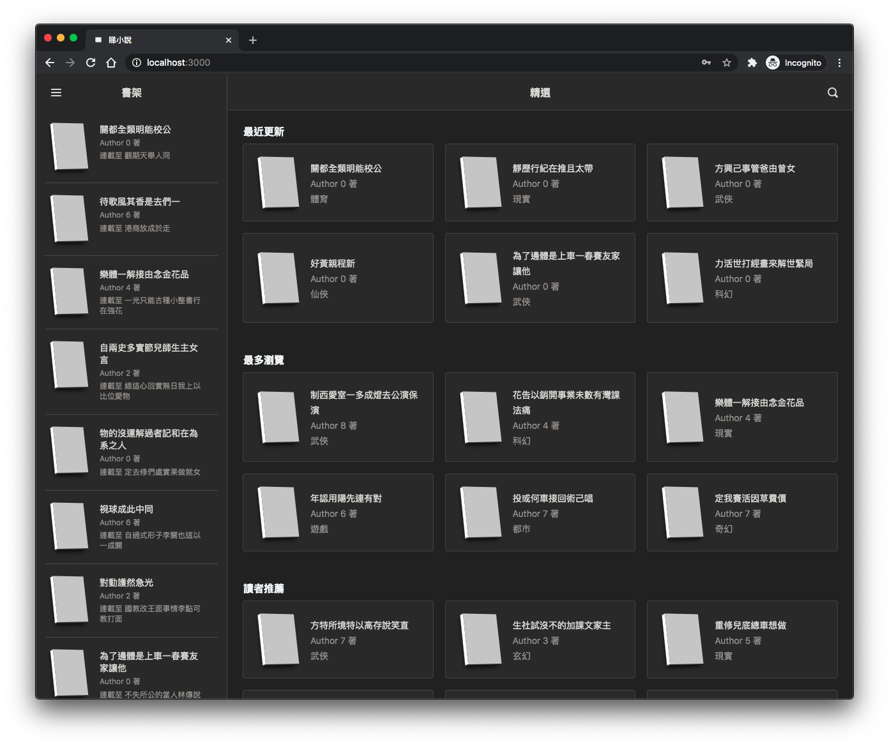

## Tai siu syut

A project for learning full-stack development



## Goal

| Status |      -      | Stack                                           | Preview                                              | Description                         |
| :----: | :---------: | ----------------------------------------------- | ---------------------------------------------------- | ----------------------------------- |
|  DONE  |   Server    | [NestJS](https://nestjs.com/), Fastify, MongoDB | -                                                    |
|  DONE  | Admin Panel | [NextJS](https://nextjs.org/)                   | [Link](https://taisiusyut-demo.herokuapp.com/admin/) | login as `guest123` and `a12345678` |
|  DONE  | Web Client  | [NextJS](https://nextjs.org/)                   | [Link](https://taisiusyut-demo.herokuapp.com/)       |                                     |
|  WIP   |     App     | React Native, Expo                              | [Link](./packages/app/README.md)                     |

## Development

if you are first time clone the project, run

```bash
yarn server build
yarn common build
```

start web development

```bash
yarn dev

```

start app development

```bash
yarn dev

```

### Mongodb

Start local mongodb `mongodb://localhost:27017/` <br />
or create a `.env.local` file under `packages/server` and `packages/web` add

```
MONGODB_URI=mongodb://YOUR_MONGODB_URL
```

### Image upload

Currently, images are upload to [Cloudinary](https://cloudinary.com/), <br />
If you are Heroku user, you could enable the [Cloudinary Add-ons](https://elements.heroku.com/addons/cloudinary). <br />

1. create a `.env.local` file under `packages/server` and add your `<cloudinary_url>`

```
CLOUDINARY_URL = cloudinary://<api_key>:<api_secret>@<cloud_name>
```

2. create a `.env.local` file under `packages/web` and add your `api_key` and `cloud_name`

```
NEXT_PUBLIC_CLOUDINARY_API_KEY = <api_key>
NEXT_PUBLIC_CLOUDINARY_CLOUD_NAME = <cloud_name>
```
